# Architecture Diagrams - Plant Care System

## 1. System Architecture Overview

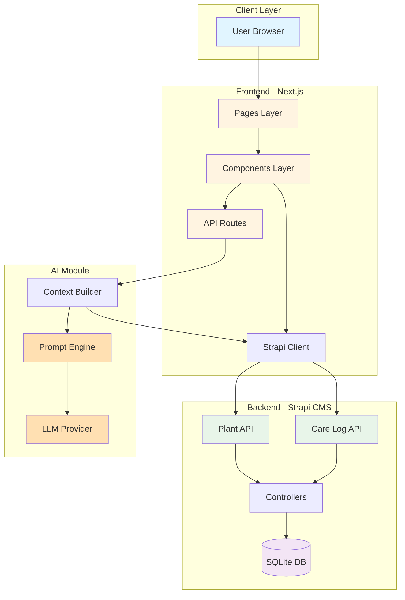

## 2. Data Flow - Plant Management

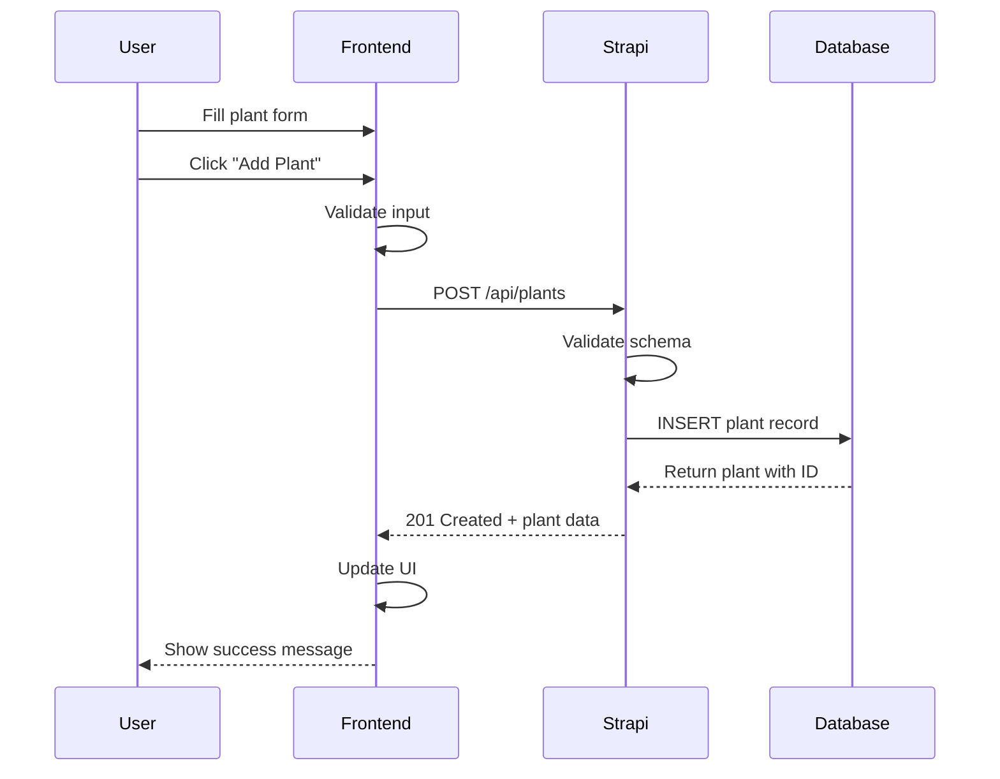

## 3. Data Flow - AI Consultation

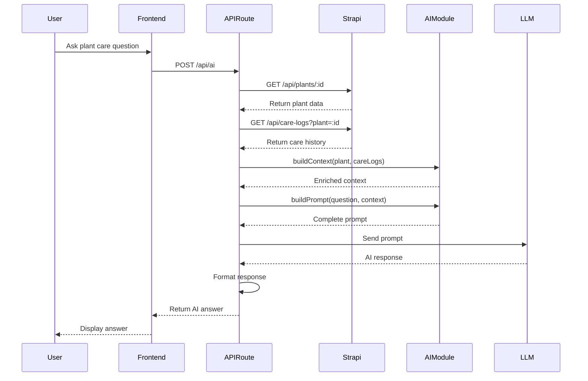

## 4. Data Flow - Care Logging

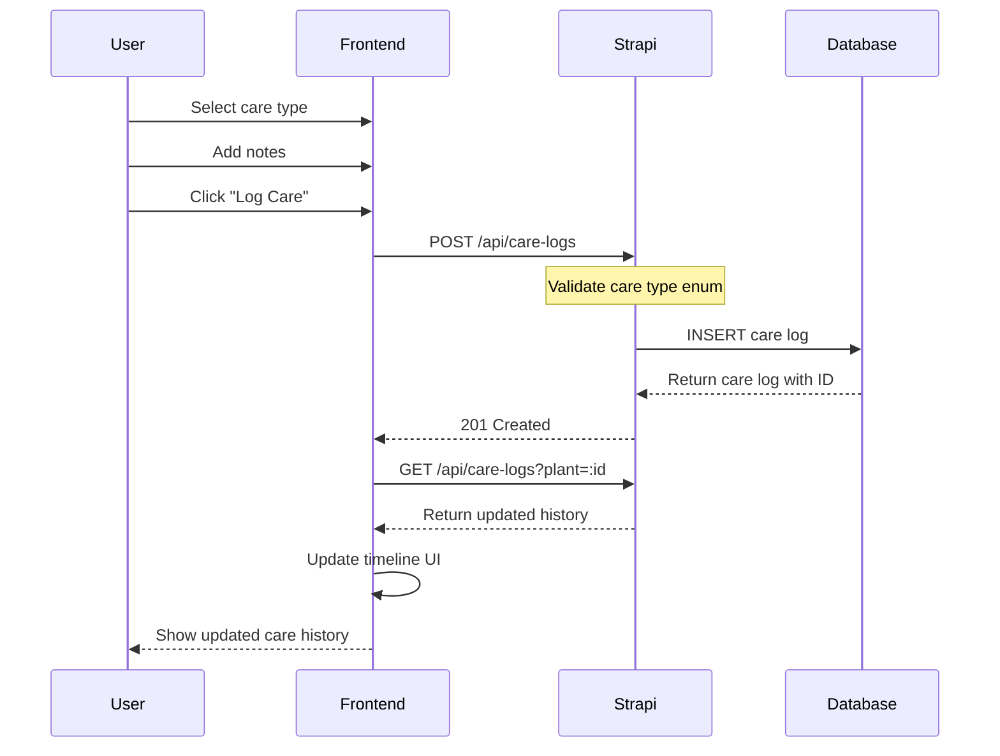

## 5. Component Hierarchy

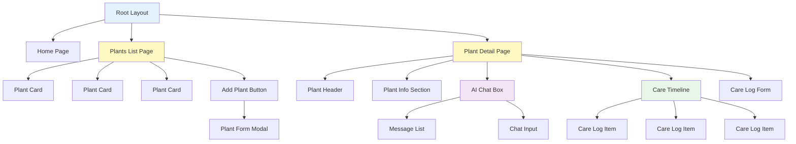

## 6. Monorepo Structure Visualization

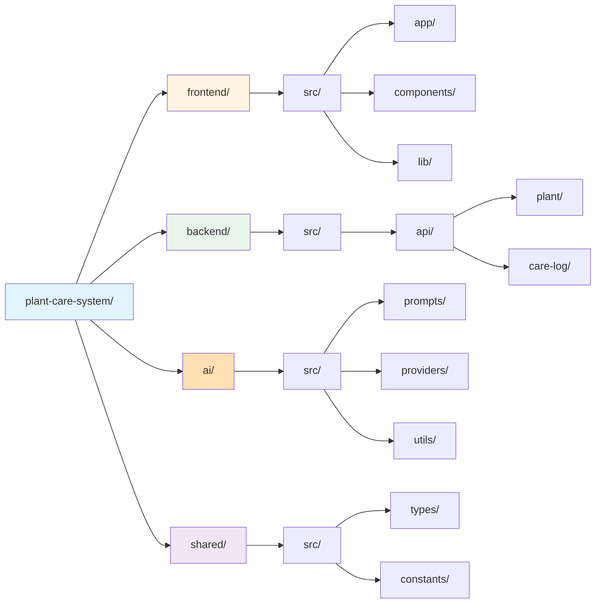

## 7. Parallel Development Workflow

```mermaid
gantt
    title Hackathon Development Timeline
    dateFormat HH:mm
    axisFormat %H:%M
    
    section Setup
    Project Init           :done, setup1, 00:00, 1h
    Shared Types          :done, setup2, 01:00, 1h
    Strapi Models         :done, setup3, 02:00, 2h
    
    section Dev A - Frontend
    UI Components         :active, devA1, 04:00, 4h
    Strapi Integration    :devA2, 08:00, 4h
    AI Integration        :devA3, 12:00, 4h
    UI Polish            :devA4, 16:00, 4h
    
    section Dev B - AI
    Prompt Design         :active, devB1, 04:00, 4h
    LLM Integration       :devB2, 08:00, 4h
    Context Builder       :devB3, 12:00, 4h
    AI Optimization       :devB4, 16:00, 4h
    
    section Integration
    Testing              :test1, 20:00, 2h
    Demo Prep            :demo1, 22:00, 2h
```

## 8. Data Model Relationships

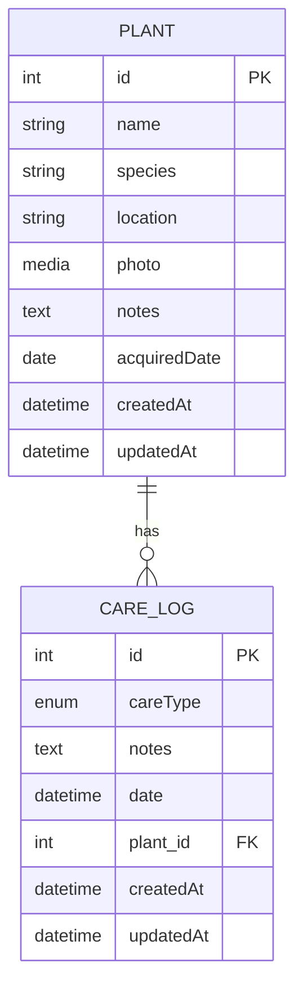

## 9. AI Module Architecture

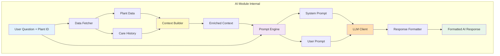

## 10. Deployment Architecture

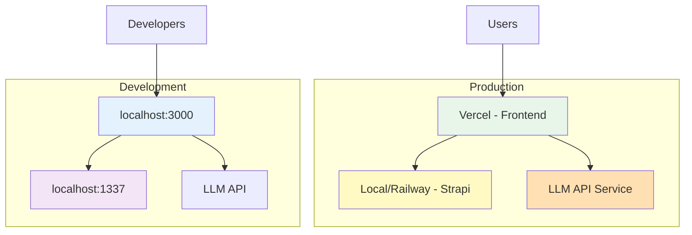

## 11. IBM Bob Integration Points

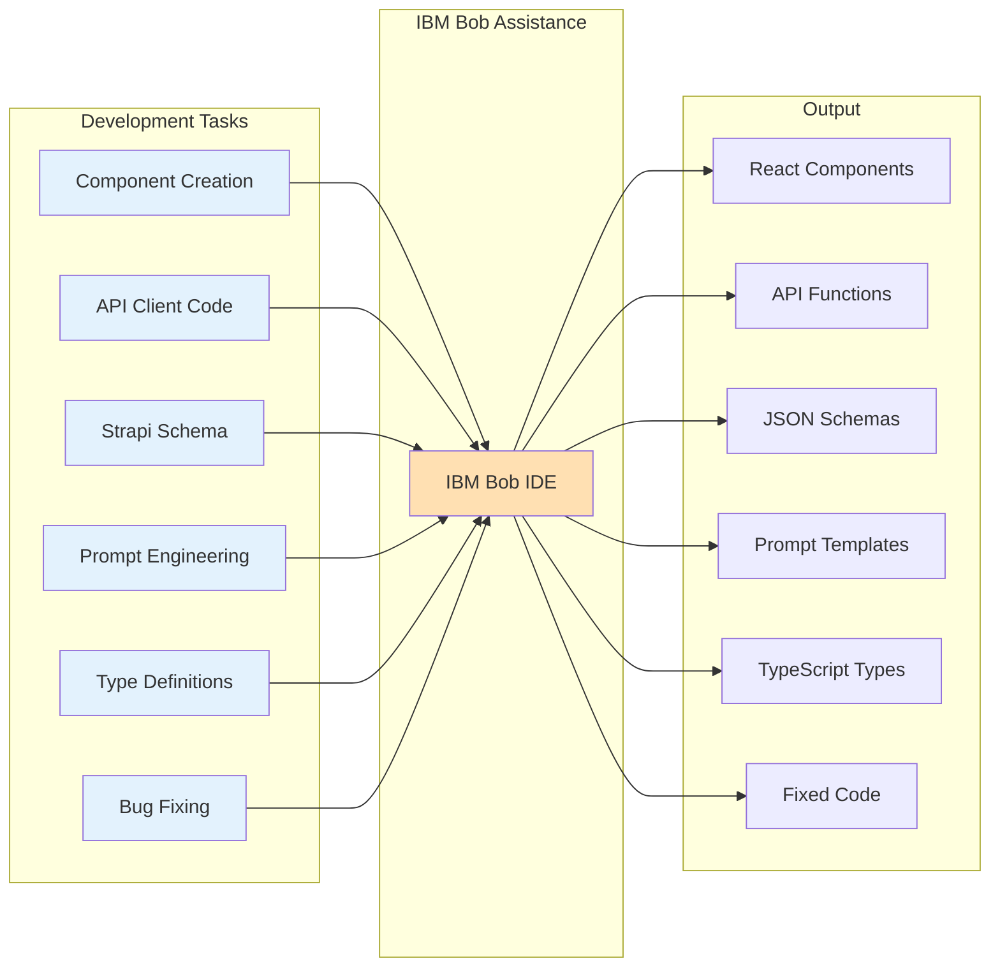

## 12. User Journey Flow

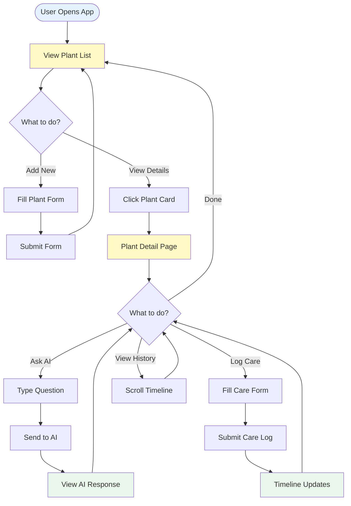

---

## Notes on Diagrams

All diagrams are created using Mermaid syntax for easy rendering in markdown viewers and documentation platforms. These diagrams provide visual clarity for:

1. **System Architecture**: High-level component interaction
2. **Data Flows**: Step-by-step sequence of operations
3. **Component Hierarchy**: Frontend structure organization
4. **Development Workflow**: Parallel team coordination
5. **Data Models**: Database relationships
6. **Deployment**: Production vs development environments
7. **User Journey**: End-to-end user experience

Use these diagrams during:
- Team onboarding
- Architecture discussions
- Demo presentations
- Documentation